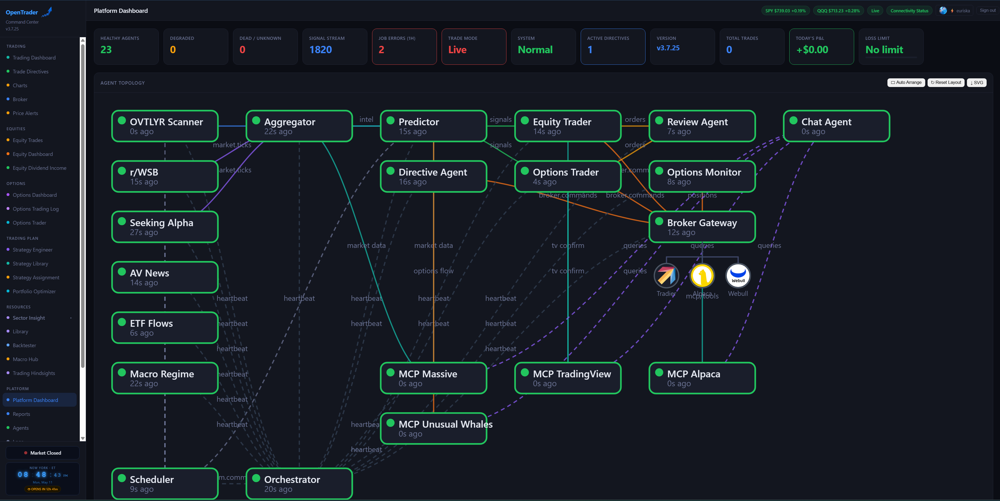

> ⚠️ **OpenTrader can lose real money.** Read the [Risk Disclosure](./RISK_DISCLOSURE.md)
> and [Terms of Use](./TERMS.md) before connecting to a live account. By using this
> software, you accept full responsibility for all trades it executes.

# OpenTrader

An AI-driven algorithmic trading platform built on a microservices architecture using Podman, Redis, and TimescaleDB. Supports multiple brokers (Tradier, Alpaca, Webull) with a real-time web dashboard, LLM-powered signals, automated trade execution, and real backtesting.



[](https://github.com/euriska/opentrader/releases)
[](LICENSE)

---

## Features

- **Multi-broker support** — Tradier, Alpaca, and Webull (paper + live accounts)
- **AI-powered signals** — LLM predictor via OpenRouter (Claude, GPT-4o, and more)
- **Real-time WebUI** — Dark-themed SPA dashboard with live WebSocket updates
- **Secure login system** — Username/password auth with PBKDF2-SHA256 hashing and HMAC-SHA256 JWT session cookies; first-run `/setup` page creates the admin account automatically; all routes protected by auth middleware
- **Encrypted secret storage** — API keys stored encrypted in DB (AES-128-CBC + HMAC-SHA256 via Fernet keyed from `SECRET_KEY`); never returned to the browser; managed via the My Profile page
- **TradingView Charts** — Candlestick charts with EMA/SMA/BB/RSI/MACD overlays, live position picker (equity and options positions; Alpaca OCC contract IDs auto-resolved to underlying ticker), and per-ticker sentiment sub-panel (F&G score, component breakdown, 30-day trend sparkline)
- **Market Breadth** — OVTLYR bull/bear breadth gauge with crossover detection and sparkline history
- **Unified Market News** — Combined Alpha Vantage sentiment feed and Massive.com macro news in a single card; source badges (AV / MKT); filter by source and AV category; articles sorted newest-first
- **Trading Dashboard layout** — Macro Regime card, Market Breadth, Portfolio NAV, and Daily P&L in a fast-scanning card arrangement; version broadcast via WebSocket on every update cycle
- **Daily P&L accuracy** — Timezone-anchored to US Eastern; scanner-induced false option closures excluded; negative values display with correct sign
- **Equity / Options separation** — Active Positions, Trades, and Dividends pages show equity-only data; Options Dashboard is a dedicated section
- **Options Dashboard** — Live options positions with DTE, strike, delta, ATR levels, underlying price, buy/sell signal, live Polygon options chain; Portfolio Greeks panel (Δ/Θ/ν/Γ per underlying); YTD Performance panel; stat card hover tooltips; download and scheduled email report
- **Options Trader** — Full-featured trading dashboard: account selector, open positions panel with DTE, OVTLYR buy-signal list, LightweightCharts candlestick chart with EMA 10/20/50 + earnings/ex-dividend markers, broker-native options chain (Tradier → Webull → Alpaca) with extrinsic value, IV, greeks, blue position highlighting; multi-leg order builder; Risk & Sizing Calculator with per-account default risk % and deviation warning
- **Options Trading Log** — Full P&L history as broker → account → ticker tree; milestone chains (Open → Roll → Closed/Expired); per-event P&L; post-close AI analysis via Claude Haiku; YTD performance panel; 18-month retention
- **Options phantom-close prevention** — Redis-backed consecutive-miss counter (`MISS_THRESHOLD=3`) prevents scanner from closing a position due to a transient broker drop
- **Options Expiry Calendar** — Active positions grouped by expiration date with DTE urgency color coding; per-expiry Greeks totals
- **1pm Report — SGOV ex-dividend alert** — Daily email report includes SELL/BUY banners around SGOV's ex-dividend date; IRA accounts identified dynamically from env flags
- **Strategy Engineer** — AI-assisted strategy builder with version control and real Backtrader backtesting; pulls live TradingView data during strategy design
- **Backtrader Engine** — EMA 10/21 crossover with configurable stop-loss/take-profit, full trade log, PDF + CSV exports, equity curve and indicator charts
- **Trade Directives** — Natural-language GTC directives evaluated every 5 minutes by an LLM agent and executed automatically
- **Market Intelligence** — Per-ticker pipeline: WSB sentiment, SeekingAlpha, Massive.com news, analyst ratings, earnings proximity, and Unusual Whales options flow + dark pool data
- **Quick Intel** — On-demand per-ticker intelligence card: WSB mention count + sentiment, SeekingAlpha analysis, Massive.com news, Unusual Whales flow
- **Unusual Whales MCP** — Real-time options flow, dark pool prints, market tide, greek exposure, and short interest via MCP server
- **Portfolio NAV History** — 90-day equity curve from daily broker snapshots; drawdown tracking
- **Daily P&L / Loss Limit** — Trading Dashboard widget with color-coded budget bar and circuit breaker banner
- **Scheduler** — Market-hours-aware job runner with DB-persisted configuration and per-job execution history (last run, status chip, error, run count)
- **MCP Agents** — Model Context Protocol servers for Alpaca, TradingView, Unusual Whales, and Massive.com (Polygon.io)
- **Equity Dividend Income** — Full dividend tracking: per-broker filter, rolling 12-month bar chart (actual vs projected), upcoming ex-dividend panel (7-day), received history; income projection uses actual payment history (no synthetic rates)
- **Ticker Classification** — GICS sector and industry for all open position tickers fetched via direct HTTP and stored persistently in a `ticker_classification` DB table; feeds the sector/industry exclusion system
- **Library** — Trading book library with ISBN lookup, cover art, ratings, and reader rank achievement system
- **Notifications** — Telegram, Discord, and AgentMail alerts
- **EOD Review** — Automated end-of-day trade analysis and recommendations
- **Self-healing** — Orchestrator watchdog with circuit breaker and auto-restart

---

## Architecture

```
┌─────────────────────────────────────────────────────────────┐
│                     WebUI (port 8080)                       │
│           FastAPI + WebSocket + Static SPA                  │
│         Username/password auth · JWT session cookies        │
└─────────────────────┬───────────────────────────────────────┘
                      │ Redis Streams / Pub-Sub
      ┌───────────────┼───────────────────────┐
      │               │                       │
┌─────▼──────┐  ┌─────▼───────┐  ┌───────────▼──────────┐
│ Scheduler  │  │Orchestrator │  │   Broker Gateway     │
│ APScheduler│  │ Watchdog    │  │ Tradier/Alpaca/Webull │
│ + DB jobs  │  │ Circuit Bkr │  │ connectors           │
└────────────┘  └─────────────┘  └──────────────────────┘
      │
┌─────▼──────────────────────────────────────────────────┐
│  Agents: Predictor · Traders · Scrapers · Review        │
└────────────────────────────────────────────────────────┘
      │
┌─────▼──────────────┐  ┌────────────────────┐  ┌──────────────────────────────┐
│  Aggregator        │  │  Directive Agent   │  │  TimescaleDB (pg16)          │
│  Sentiment + UW    │  │  LLM GTC evaluator │  │  trades, signals, sentiment, │
│  intel pipeline    │  │  order executor    │  │  scheduler_jobs, dividends   │
└────────────────────┘  └────────────────────┘  └──────────────────────────────┘
      │
┌─────▼───────────────┐
│  Redis 7            │
│  Streams, pub/sub   │
│  job + intel cache  │
└─────────────────────┘

MCP Layer: Alpaca · TradingView · Unusual Whales · Massive.com (Polygon.io)
```

---

## Services

| Container | Description | Port |
|---|---|---|
| `ot-webui` | Command Center dashboard | 8080 |
| `ot-scheduler` | APScheduler job runner | — |
| `ot-orchestrator` | Heartbeat watchdog + circuit breaker | — |
| `ot-broker-gateway` | Multi-broker position/order router | — |
| `ot-directive-agent` | LLM-evaluated GTC trade directives | — |
| `ot-trader-equity` | Equity order executor | — |
| `ot-trader-options` | Options order executor | — |
| `ot-options-monitor` | Options position tracker + ATR level manager | — |
| `ot-chat-agent` | AI chat with MCP tool access | — |
| `ot-review-agent` | EOD trade review | — |
| `ot-predictor` | LLM signal scoring + ML ensemble | — |
| `ot-aggregator` | Sentiment + intel pipeline (enriches predictor candidates) | — |
| `ot-scraper-ovtlyr` | OVTLYR market breadth scraper | — |
| `ot-scraper-wsb` | WallStreetBets Reddit scraper | — |
| `ot-scraper-seekalpha` | SeekingAlpha sentiment scraper | — |
| `ot-scraper-news` | Macro news scraper | — |
| `ot-scraper-etf-flows` | ETF flow data scraper | — |
| `ot-scraper-macro-regime` | Macro regime signal scraper | — |
| `ot-mcp-alpaca` | Alpaca MCP server | — |
| `ot-mcp-tradingview` | TradingView MCP server | — |
| `ot-mcp-unusualwhales` | Unusual Whales MCP server | — |
| `ot-mcp-massive` | Massive.com / Polygon.io MCP server | — |
| `ot-redis` | Redis 7 | — |
| `ot-timescaledb` | TimescaleDB (PostgreSQL) | — |
| `ot-vault` | HashiCorp Vault (secrets) | — |
| `ot-prometheus` | Metrics collection | — |
| `ot-grafana` | Metrics dashboard | 3000 |

---

## Quick Start

### Prerequisites
- Podman 4.0+ and podman-compose 1.0+
- Linux (tested on Ubuntu 24+)

### Install from source

```bash
git clone https://github.com/euriska/opentrader.git
cd opentrader
git submodule update --init --recursive

# Configure credentials
cp .env.sample .env
nano .env  # fill in your API keys and set SECRET_KEY

# Configure broker accounts
cp config/accounts.toml.sample config/accounts.toml
# accounts.toml uses ${ENV_VAR} references — set vars in .env

# Build and start
podman-compose up -d

# Open dashboard — you'll be redirected to /setup on first run
open http://localhost:8080
```

The first visit redirects to `/setup` where you create the admin username and password. After that, `/login` is the entry point. API keys are managed in **Platform → My Profile** and stored encrypted in the database.

### Install from pre-built images

Pre-built container images are published to GitHub Container Registry on every release.

```bash
git clone https://github.com/euriska/opentrader.git
cd opentrader
git submodule update --init --recursive

cp .env.sample .env && nano .env
cp config/accounts.toml.sample config/accounts.toml

# Pull images
export OT_VERSION=3.7.13
podman pull ghcr.io/euriska/ot-webui:${OT_VERSION}
podman pull ghcr.io/euriska/ot-python:${OT_VERSION}
podman pull ghcr.io/euriska/ot-mcp-tradingview:${OT_VERSION}
podman pull ghcr.io/euriska/ot-mcp-unusualwhales:${OT_VERSION}

podman-compose up -d
```

---

## Releasing

Releases use semantic versioning (`MAJOR.MINOR.PATCH`). Patch resets at 99 (e.g. `3.5.99 → 3.6.0`). The `VERSION` file is the single source of truth.

```bash
echo "X.Y.Z" > VERSION
# Edit CHANGELOG.md with release notes
git add VERSION CHANGELOG.md <changed-files>
git commit -m "feat/fix: description vX.Y.Z"
git push
gh release create vX.Y.Z --title "vX.Y.Z" --notes "Release notes here"
```

---

## Configuration

### `.env` — Required keys

| Variable | Description |
|---|---|
| `SECRET_KEY` | 32-byte hex key for JWT signing and API key encryption — generate with `openssl rand -hex 32`; random if unset (sessions invalidated on restart) |
| `OPENROUTER_API_KEY` | LLM provider — get at openrouter.ai |
| `DB_PASSWORD` | TimescaleDB password |
| `MASSIVE_API_KEY` | Massive.com / Polygon.io API key (quotes, news, dividends, earnings, market bars) |
| `TRADIER_SANDBOX_API_KEY` | Tradier paper trading key |
| `TRADIER_PRODUCTION_API_KEY` | Tradier live trading key |
| `ALPACA_API_KEY` | Alpaca paper API key |
| `ALPACA_API_SECRET` | Alpaca paper API secret |
| `ALPACA_LIVE_API_KEY` | Alpaca live API key |
| `ALPACA_LIVE_API_SECRET` | Alpaca live API secret |
| `WEBULL_API_KEY` | Webull API key |
| `WEBULL_SECRET_KEY` | Webull secret key |
| `UNUSUAL_WHALES_API_KEY` | Unusual Whales API key (options flow + dark pool) |
| `TELEGRAM_BOT_TOKEN` | Telegram bot token (optional) |
| `DISCORD_WEBHOOK_URL` | Discord webhook (optional) |
| `AGENTMAIL_API_KEY` | AgentMail key for email reports (optional) |
| `OVTLYR_EMAIL` / `OVTLYR_PASSWORD` | OVTLYR credentials (optional) |

> **Note:** `SECRET_KEY` must be stable across restarts — if unset, a random key is generated each time, invalidating all session cookies. Set it once with `echo "SECRET_KEY=$(openssl rand -hex 32)" >> .env`.

See `.env.sample` for the full list.

### Broker accounts — `config/accounts.toml`

Copy from `config/accounts.toml.sample`. All account IDs reference `${ENV_VAR}` so no credentials are stored in the file itself. Additional API keys (broker tokens, notification webhooks) can also be managed through **Platform → My Profile** in the dashboard, where they are stored encrypted in the database.

---

## WebUI Navigation

The dashboard is organized into six sections:

### Trading
| Page | Description |
|---|---|
| Trading Dashboard | Live stat cards (equity/options split), market breadth, NAV history, daily P&L, macro regime |
| Trade Directives | Natural-language GTC directives with LLM evaluation and order execution |
| Charts | Candlestick charts with indicator overlays, live position picker (equity + options), sentiment sub-panel |
| Broker | Broker credential configuration, account management, per-account risk % defaults |

### Equities
| Page | Description |
|---|---|
| Equity Trades | Equity fills and open orders grouped by week, with per-account tally and friendly reject reasons |
| Equity Dashboard | Live equity positions across all broker accounts with heatmaps, P&L, and liquidate action |
| Equity Dividend Income | Dividend tracking with per-broker filtering, actual-vs-projected bar chart, upcoming events, history |

### Options
| Page | Description |
|---|---|
| Options Dashboard | Live options positions with DTE, strike, delta, ATR levels, live Polygon options chain, Portfolio Greeks, Expiry Calendar, and YTD Performance |
| Options Trader | Full trading dashboard — account selector, positions panel, OVTLYR signals, EMA chart, live broker chain, multi-leg order builder, risk calculator |
| Options Trading Log | Full P&L tree (broker → account → ticker) with milestone chains, AI post-close analysis, and YTD performance |

### Trading Plan
| Page | Description |
|---|---|
| Strategy Engineer | AI-assisted strategy builder with version history and Backtrader backtesting |
| Strategy Library | All saved strategy versions with backtest results |
| Strategy Assignment | Assign strategies to tickers for live execution |

### Resources
| Page | Description |
|---|---|
| Library | Trading book library with ISBN lookup, cover art, star ratings, and reader rank achievement system |

### Platform
| Page | Description |
|---|---|
| Platform Dashboard | Agent health, topology diagram, job error counts |
| Agents | Per-container status, log viewer, and health indicators |
| Configuration | Connector credentials, sector/stock exclusions, risk controls |
| Logs | Live container log viewer |
| Scheduler | Job manager — create, edit, enable/disable, run now; per-job execution history with last run, status chip, and run count |
| System | Circuit breaker, halt/resume, container table |
| My Profile | Avatar, change password, full API key management (22 keys with set/unset status, inline update and delete) |

---

## Backtesting

The Strategy Engineer includes a real **Backtrader** backtesting engine:

- **EMA 10/21 crossover** strategy with configurable stop-loss and take-profit
- **Benchmark ticker** saved per strategy (default: SPY)
- **Full trade log** — entry/exit dates, prices, qty, P&L, exit reason
- **Exports** — PDF and CSV trade reports available from the Trades tab
- **Charts** — price + EMA lines with trade markers, volume panel, equity curve
- **Version-linked** — each strategy version stores its own backtest results for comparison

---

## Market Intelligence Pipeline

The aggregator enriches each candidate ticker with data from multiple sources before the predictor scores it:

| Source | Data |
|---|---|
| WSB scraper | Mention count, sentiment score, top headlines |
| SeekingAlpha scraper | Professional analysis sentiment |
| Massive.com / Polygon.io | News, analyst consensus, short interest |
| Unusual Whales | Options flow (bullish/bearish counts, net premium), dark pool prints |

Intelligence is cached in Redis (`aggregator:intel:{ticker}`) and used to adjust predictor confidence by up to ±0.20.

---

## Dividend Data Sources

| Purpose | Source | Notes |
|---|---|---|
| Income projection | `dividend_history` DB table | Actual payments backfilled from broker history; `forward_annual_rate = recent_aps × annual_count` |
| Ex/pay dates, frequency | Massive.com / Polygon.io (primary) | `list_dividends` via Massive MCP, `MASSIVE_API_KEY` |
| Ex/pay dates fallback | dividend.com scrape | Usually Cloudflare-blocked; falls through gracefully |
| Upcoming events | Massive.com → dividendchannel.com → DB | Three-tier for 7-day forward calendar |

---

## Ticker Classification (GICS)

Sector and industry data for all open position tickers is stored in the `ticker_classification` DB table (30-day TTL per ticker) and synced to Redis hashes (`ticker:sectors` / `ticker:industries`) consumed by the trader exclusion system. The WebUI background task refreshes stale records automatically at startup.

---

## Supported Brokers

| Broker | Paper | Live | Notes |
|---|---|---|---|
| Tradier | ✅ | ✅ | Equities + options |
| Alpaca | ✅ | ✅ | Equities, crypto |
| Webull | ✅ | ✅ | Equities, options |

---

## License

Apache License 2.0 — see [LICENSE](LICENSE) for details.
